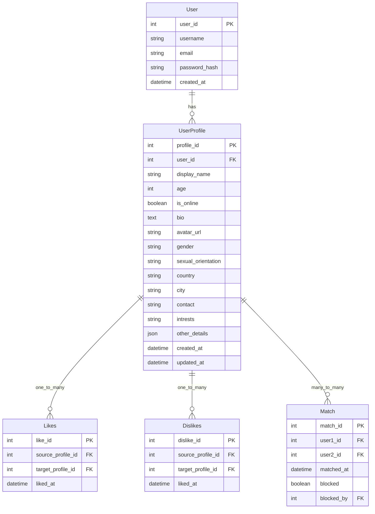

<<<<<<< HEAD
# HeartHub 🫶🏻

To Do (After finishing the project, add here an image of how the main page looks like)

# SUBMISSION

## **Deployment**
* The platform is deployed using Heruko, making it accessible globally without additional hosting costs.
* Continuous updates and improvements are made to enhance the user experience and security.

[Click this link to view the Website.]() .... To Do...


## **Criteria**

Our team addressed these applicable criteria:

- ✨ Project is Full-Stack
- ✨ Project must be based on reality, inspired by Dating Webpages.
- ✨ Basic Readme.md in place

# **🧑‍💻 About the Submission**


## **Intro**

Welcome to Heart Hub 🫶🏻 a dating web app built to connect people in a straightforward and reliable way. Inspired by the idea of “Love.exe – Coding connections in the digital age,” Heart Hub uses modern technology and smart matchmaking to help users find genuine relationships. We focus on creating a platform that’s user-friendly, safe, and accessible for everyone.


## **Goal**

Our goal is to redefine online dating by developing a service that emphasizes inclusion, safety, and simplicity. We aim to use innovative algorithms and clear design to ensure that every user has a smooth experience while finding meaningful connections in a secure digital space.

## User Stories


#### 1. Registration
**As a user**, I can sign up for the application so that I can start using the application.

**Acceptance Criteria:**
1. User signs up with valid email and strong password
2. User gets feedback on screen if signup is successful or not
3. User gets redirected to the Login page if signup is successful

#### 2. Sign In
**As a registered user**, I can log into the application so that I can access my account and use the features.

**Acceptance Criteria:**
1. User can enter email and password to login
2. User gets feedback if credentials are incorrect
3. User gets redirected to profile feed after successful login
4. User session is maintained until logout
5. User can request password reset if forgotten

#### 3. Log Out
**As a logged-in user**, I can log out of the application so that my account remains secure when I'm not using it.

**Acceptance Criteria:**
1. User can log out from any page in the application
2. User session is terminated upon logout
3. User is redirected to login page after logout
4. User cannot access protected routes after logging out

#### 4. Profile Feed
**As a logged-in user**, I can view a feed of profiles so that I can discover and connect with other users.

**Acceptance Criteria:**
1. User can view a list of other user profiles
2. Feed shows basic profile information (name, photo, status)
3. Feed updates automatically or can be manually refreshed
4. User can scroll through profiles with pagination
5. User can search/filter profiles based on criteria

#### 5. Profile Detail
**As a logged-in user**, I can view and edit my profile details so that I can maintain my information and customize my presence.

**Acceptance Criteria:**
1. User can view their complete profile information
2. User can edit their profile details (name, photo, bio, etc.)
3. User can see changes reflected immediately after saving
4. User gets feedback when profile updates are successful/unsuccessful
5. User can view other users' profiles in read-only mode

#### 6. Chat
**As a logged-in user**, I can chat with other users so that I can communicate and interact with them.

**Acceptance Criteria:**
1. User can start a new chat with another user
2. User can send and receive text messages in real-time
3. User gets notifications for new messages
4. User can see online/offline status of other users
5. Chat history is preserved between sessions
6. User can see when messages are read/delivered


## Postponed till next Iteration
The initial goal was to implement a live private messaging system using **Channels** and Websockets. The idea got discarded due to complexity, that would jeopardize the goal of dilivering before the dead line. 

This feature can be implemented in the next iteration, though. 

## UX 
### Colors
-  Incorporate a palette of four colors.
To Do .... 

### Typography
- font...... To Do

### Imagery


## Wireframes


## System Design

### Entity Relationship Diagram for Chat Application

This ERD represents a simplified model for a chat application with public and private chat rooms, user profiles, and file attachments.




## **💻 Tech Stack**
This platform is built using modern web technologies to ensure accessibility, responsiveness, and ease of use:
* HTML: For structuring the content of the website.
* CSS: For styling and visual enhancements.
* React: To enable dynamic interactivity and functionality.
* Django REST Framework: Used for ... To Do.
* Bootstrap: A front-end framework to ensure a mobile-friendly and responsive layout.


## Features


## Testing 


## Validation

1. W3C Markup Validator ( [Results]() )
    - To Do ...
    
1. W3C CSS Validator ( [Results]() )
    - To Do ...

1. Jshint javascript validator ([Results]())
    - To Do ..


## Performance

The website performance was examined using the [Google Lighthouse](https://developers.google.com/web/tools/lighthouse/)

Click on [Results]() to view the performance.... To Do

## Credits

1. Resources used : 
    -  https://github.com/aop4/heroku-django-REST-template

# Team members

- **Many thanks to the team members for the hard work and cooperation.**

  - **Warren Smith** - [GitHub](https://github.com/Wxrren), [LinkedIn](https://www.linkedin.com/in/warren-smith-b43b20183/
  )
   Design/ Development / Documentation

  - **Nazek Altayeb** - [GitHub](https://github.com/Nazek-Altayeb), [LinkedIn](https://www.linkedin.com/in/nazek-a-altayeb/)
   Design/ Development / Documentation

  - **Dimitri** - [GitHub](https://github.com/dimitri-edel),
   Design/ Development / Documentation

  - **Laurie** - [GitHub](http://github.com/lmcrean),
   Design/ Development / Documentation

  - **Allan** - [GitHub](https://github.com/Allano256),
   Design/ Development / Documentation

   - **Hira** - [GitHub](https://github.com/hirakhan95),
   Design/ Development / Documentation


# Contribution


# Contact & Support
=======
    UserProfile ||--o{ Likes : one_to_many
    User ||--o{ Match : one_to_many

### Algorithm for finding a match
When user likes someone, check if the the other user likes them back

#### Like User View (Django REST Framework)

This code implements a Django REST Framework view that handles user "likes" and creates matches when reciprocal likes occur.

```python
from rest_framework import status
from rest_framework.response import Response
from rest_framework.views import APIView
from .models import UserProfile, Likes, Match
from .serializers import LikesSerializer, MatchSerializer  # Create these serializers

class LikeUserView(APIView):
    def post(self, request, liked_profile_id):  # liked_profile_id is the ID of the profile being liked
        liker_profile = request.user.userprofile  # Assuming authentication is handled and user has a profile
        try:
            liked_profile = UserProfile.objects.get(pk=liked_profile_id)
        except UserProfile.DoesNotExist:
            return Response({"error": "Liked profile not found."}, status=status.HTTP_404_NOT_FOUND)

        # Check if the like already exists (prevent duplicate likes)
        if Likes.objects.filter(liker_profile=liker_profile, liked_profile=liked_profile).exists():
            return Response({"message": "You already liked this user."}, status=status.HTTP_400_BAD_REQUEST)

        # Create the Like record
        like_data = {"liker_profile": liker_profile.pk, "liked_profile": liked_profile.pk}
        like_serializer = LikesSerializer(data=like_data)
        if like_serializer.is_valid():
            like = like_serializer.save()

            # Check for a reciprocal like (Match)
            if Likes.objects.filter(liker_profile=liked_profile, liked_profile=liker_profile).exists():
                # Create the Match
                try:
                    # Check if the match already exists to prevent duplicates
                    Match.objects.get(user1=liker_profile, user2=liked_profile) # Or the reverse order
                    return Response({"message": "Already matched with this user"}, status=status.HTTP_400_BAD_REQUEST)

                except Match.DoesNotExist:
                    match_data = {"user1": liker_profile.pk, "user2": liked_profile.pk} # Or the reverse order
                    match_serializer = MatchSerializer(data=match_data)
                    if match_serializer.is_valid():
                        match = match_serializer.save()
                        return Response({"message": "You have a match!", "match_id": match.pk}, status=status.HTTP_201_CREATED)
                    else:
                        return Response(match_serializer.errors, status=status.HTTP_400_BAD_REQUEST)
            return Response({"message": "Like recorded."}, status=status.HTTP_201_CREATED)
        else:
            return Response(like_serializer.errors, status=status.HTTP_400_BAD_REQUEST)
```

#### Serializer (example)
```python
from rest_framework import serializers
from .models import Likes, Match

class LikesSerializer(serializers.ModelSerializer):
    class Meta:
        model = Likes
        fields = ('liker_profile', 'liked_profile')  # Or just 'id' if you want DRF to handle it

class MatchSerializer(serializers.ModelSerializer):
    class Meta:
        model = Match
        fields = ('user1', 'user2') # Or just 'id' if you want DRF to handle it

```

#### Model (example)
```python
from django.db import models
from django.contrib.auth.models import User # If you are using default django user model

class UserProfile(models.Model):
    user = models.OneToOneField(User, on_delete=models.CASCADE) # One to one with django user model
    # ... other fields ...

class Likes(models.Model):
    liker_profile = models.ForeignKey(UserProfile, on_delete=models.CASCADE, related_name='given_likes')
    liked_profile = models.ForeignKey(UserProfile, on_delete=models.CASCADE, related_name='received_likes')
    liked_at = models.DateTimeField(auto_now_add=True)

    class Meta:
        unique_together = ('liker_profile', 'liked_profile') # To prevent duplicate likes


class Match(models.Model):
    user1 = models.ForeignKey(UserProfile, on_delete=models.CASCADE, related_name='matches1')
    user2 = models.ForeignKey(UserProfile, on_delete=models.CASCADE, related_name='matches2')
    matched_at = models.DateTimeField(auto_now_add=True)

    class Meta:
        unique_together = ('user1', 'user2') # To prevent duplicate matches
```


=======
# React + TypeScript + Vite

This template provides a minimal setup to get React working in Vite with HMR and some ESLint rules.

Currently, two official plugins are available:

- [@vitejs/plugin-react](https://github.com/vitejs/vite-plugin-react/blob/main/packages/plugin-react/README.md) uses [Babel](https://babeljs.io/) for Fast Refresh
- [@vitejs/plugin-react-swc](https://github.com/vitejs/vite-plugin-react-swc) uses [SWC](https://swc.rs/) for Fast Refresh

## Expanding the ESLint configuration

If you are developing a production application, we recommend updating the configuration to enable type aware lint rules:

- Configure the top-level `parserOptions` property like this:

```js
export default tseslint.config({
  languageOptions: {
    // other options...
    parserOptions: {
      project: ['./tsconfig.node.json', './tsconfig.app.json'],
      tsconfigRootDir: import.meta.dirname,
    },
  },
})
```

- Replace `tseslint.configs.recommended` to `tseslint.configs.recommendedTypeChecked` or `tseslint.configs.strictTypeChecked`
- Optionally add `...tseslint.configs.stylisticTypeChecked`
- Install [eslint-plugin-react](https://github.com/jsx-eslint/eslint-plugin-react) and update the config:

```js
// eslint.config.js
import react from 'eslint-plugin-react'

export default tseslint.config({
  // Set the react version
  settings: { react: { version: '18.3' } },
  plugins: {
    // Add the react plugin
    react,
  },
  rules: {
    // other rules...
    // Enable its recommended rules
    ...react.configs.recommended.rules,
    ...react.configs['jsx-runtime'].rules,
  },
})
```
>>>>>>> heroku/main
