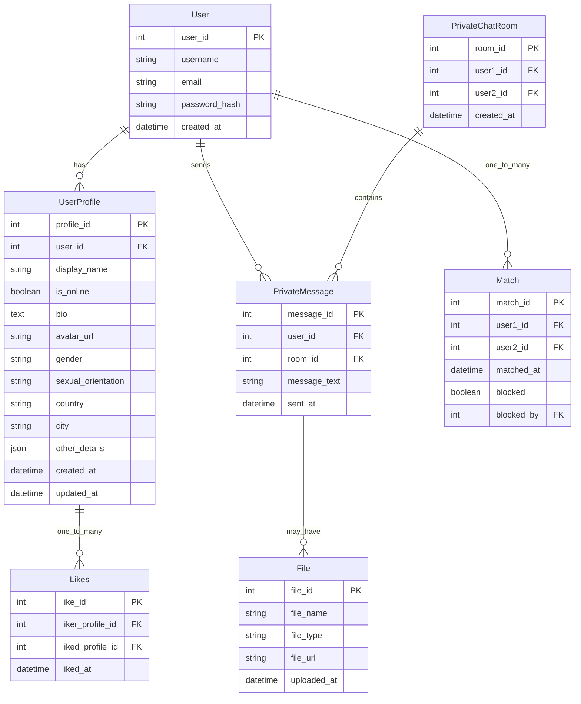

# team-5


# Resources used:

https://github.com/aop4/heroku-django-REST-template


## Entity Relationship Diagram for Chat Application

This ERD represents a simplified model for a chat application with public and private chat rooms, user profiles, and file attachments.



### Algorithm for finding a match
When user likes someone, check if the the other user likes them back

#### Like User View (Django REST Framework)

This code implements a Django REST Framework view that handles user "likes" and creates matches when reciprocal likes occur.

```python
from rest_framework import status
from rest_framework.response import Response
from rest_framework.views import APIView
from .models import UserProfile, Likes, Match
from .serializers import LikesSerializer, MatchSerializer  # Create these serializers

class LikeUserView(APIView):
    def post(self, request, liked_profile_id):  # liked_profile_id is the ID of the profile being liked
        liker_profile = request.user.userprofile  # Assuming authentication is handled and user has a profile
        try:
            liked_profile = UserProfile.objects.get(pk=liked_profile_id)
        except UserProfile.DoesNotExist:
            return Response({"error": "Liked profile not found."}, status=status.HTTP_404_NOT_FOUND)

        # Check if the like already exists (prevent duplicate likes)
        if Likes.objects.filter(liker_profile=liker_profile, liked_profile=liked_profile).exists():
            return Response({"message": "You already liked this user."}, status=status.HTTP_400_BAD_REQUEST)

        # Create the Like record
        like_data = {"liker_profile": liker_profile.pk, "liked_profile": liked_profile.pk}
        like_serializer = LikesSerializer(data=like_data)
        if like_serializer.is_valid():
            like = like_serializer.save()

            # Check for a reciprocal like (Match)
            if Likes.objects.filter(liker_profile=liked_profile, liked_profile=liker_profile).exists():
                # Create the Match
                try:
                    # Check if the match already exists to prevent duplicates
                    Match.objects.get(user1=liker_profile, user2=liked_profile) # Or the reverse order
                    return Response({"message": "Already matched with this user"}, status=status.HTTP_400_BAD_REQUEST)

                except Match.DoesNotExist:
                    match_data = {"user1": liker_profile.pk, "user2": liked_profile.pk} # Or the reverse order
                    match_serializer = MatchSerializer(data=match_data)
                    if match_serializer.is_valid():
                        match = match_serializer.save()
                        return Response({"message": "You have a match!", "match_id": match.pk}, status=status.HTTP_201_CREATED)
                    else:
                        return Response(match_serializer.errors, status=status.HTTP_400_BAD_REQUEST)
            return Response({"message": "Like recorded."}, status=status.HTTP_201_CREATED)
        else:
            return Response(like_serializer.errors, status=status.HTTP_400_BAD_REQUEST)
```

#### Serializer (example)
```python
from rest_framework import serializers
from .models import Likes, Match

class LikesSerializer(serializers.ModelSerializer):
    class Meta:
        model = Likes
        fields = ('liker_profile', 'liked_profile')  # Or just 'id' if you want DRF to handle it

class MatchSerializer(serializers.ModelSerializer):
    class Meta:
        model = Match
        fields = ('user1', 'user2') # Or just 'id' if you want DRF to handle it

```

#### Model (example)
```python
from django.db import models
from django.contrib.auth.models import User # If you are using default django user model

class UserProfile(models.Model):
    user = models.OneToOneField(User, on_delete=models.CASCADE) # One to one with django user model
    # ... other fields ...

class Likes(models.Model):
    liker_profile = models.ForeignKey(UserProfile, on_delete=models.CASCADE, related_name='given_likes')
    liked_profile = models.ForeignKey(UserProfile, on_delete=models.CASCADE, related_name='received_likes')
    liked_at = models.DateTimeField(auto_now_add=True)

    class Meta:
        unique_together = ('liker_profile', 'liked_profile') # To prevent duplicate likes


class Match(models.Model):
    user1 = models.ForeignKey(UserProfile, on_delete=models.CASCADE, related_name='matches1')
    user2 = models.ForeignKey(UserProfile, on_delete=models.CASCADE, related_name='matches2')
    matched_at = models.DateTimeField(auto_now_add=True)

    class Meta:
        unique_together = ('user1', 'user2') # To prevent duplicate matches
```

