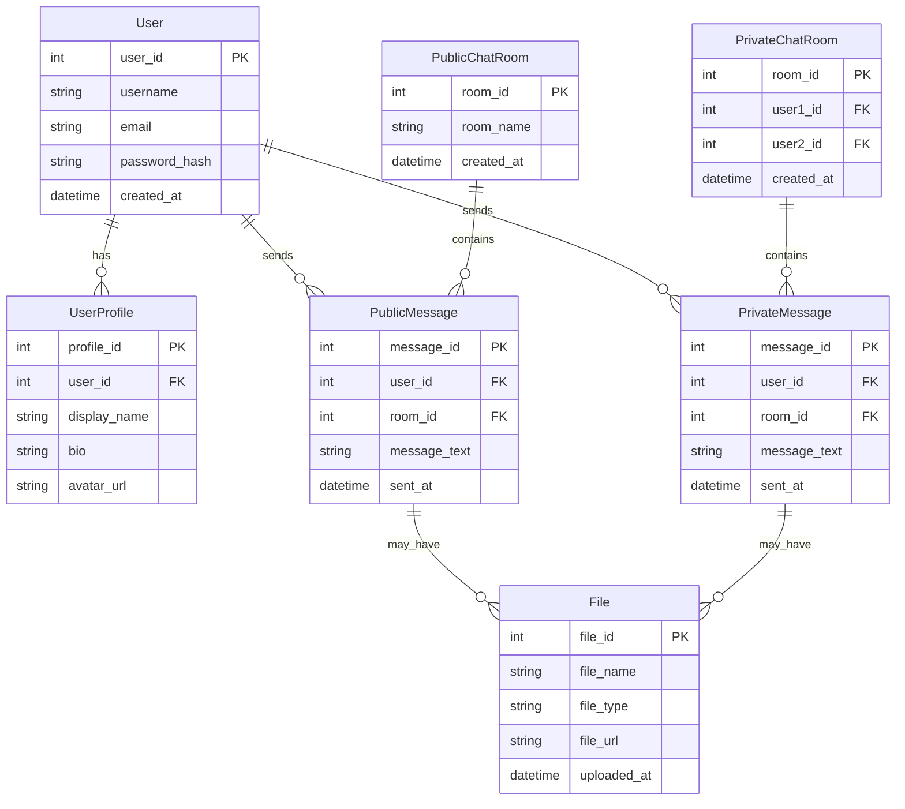

# ❤ Code to Love! ❤

To Do (After finishing the project, add here an image of how the main page looks like)

# SUBMISSION

## **Deployment**
* The platform is deployed using Heruko, making it accessible globally without additional hosting costs.
* Continuous updates and improvements are made to enhance the user experience and security.

[Click this link to view the Website.]() .... To Do...

## **Criteria**

Our team addressed these applicable criteria:

- ✨ Project is Full-Stack
- ✨ Project must be based on reality, inspired by Dating Webpages.
- ✨ Basic Readme.md in place

# **🧑‍💻 About the Submission**

## **Intro**

## **Goal**

## User Stories

* As a user, I want to be able to .... so i can ......

## UX 
### Colors
-  Incorporate a palette of four colors.
To Do .... 

### Typography
- font...... To Do

### Imagery
- Team Logo
To Do ....

## Wireframes

To Do ....

## System Design

### Entity Relationship Diagram for Chat Application

This ERD represents a simplified model for a chat application with public and private chat rooms, user profiles, and file attachments.

   

## **💻 Tech Stack**
This platform is built using modern web technologies to ensure accessibility, responsiveness, and ease of use:
* HTML: For structuring the content of the website.
* CSS: For styling and visual enhancements.
* React: To enable dynamic interactivity and functionality.
* Django REST Framework: Used for ... To Do.
* Bootstrap: A front-end framework to ensure a mobile-friendly and responsive layout.

## Features

## Testing 

## Validation

1. W3C Markup Validator ( [Results]() )
    - To Do ...
    
1. W3C CSS Validator ( [Results]() )
    - To Do ...

1. Jshint javascript validator ([Results]())
    - To Do ..

## Performance

The website performance was examined using the [Google Lighthouse](https://developers.google.com/web/tools/lighthouse/)

Click on [Results]() to view the performance.... To Do

## Credits

1. Resources used : 
    -  https://github.com/aop4/heroku-django-REST-template

# Team members

- **Many thanks to the team members for the hard work and cooperation.**

  - **Warren Smith** - [GitHub](https://github.com/Wxrren), [LinkedIn](https://www.linkedin.com/in/warren-smith-b43b20183/
  )
   Design/ Development / Documentation

  - **Nazek Altayeb** - [GitHub](https://github.com/Nazek-Altayeb), [LinkedIn](https://www.linkedin.com/in/nazek-a-altayeb/)
   Design/ Development / Documentation

  - **Dimitri** - [GitHub](https://github.com/dimitri-edel),
   Design/ Development / Documentation

  - **Laurie** - [GitHub](http://github.com/lmcrean),
   Design/ Development / Documentation

  - **Allan** - [GitHub](https://github.com/Allano256),
   Design/ Development / Documentation

# Contribution

# Contact & Support

