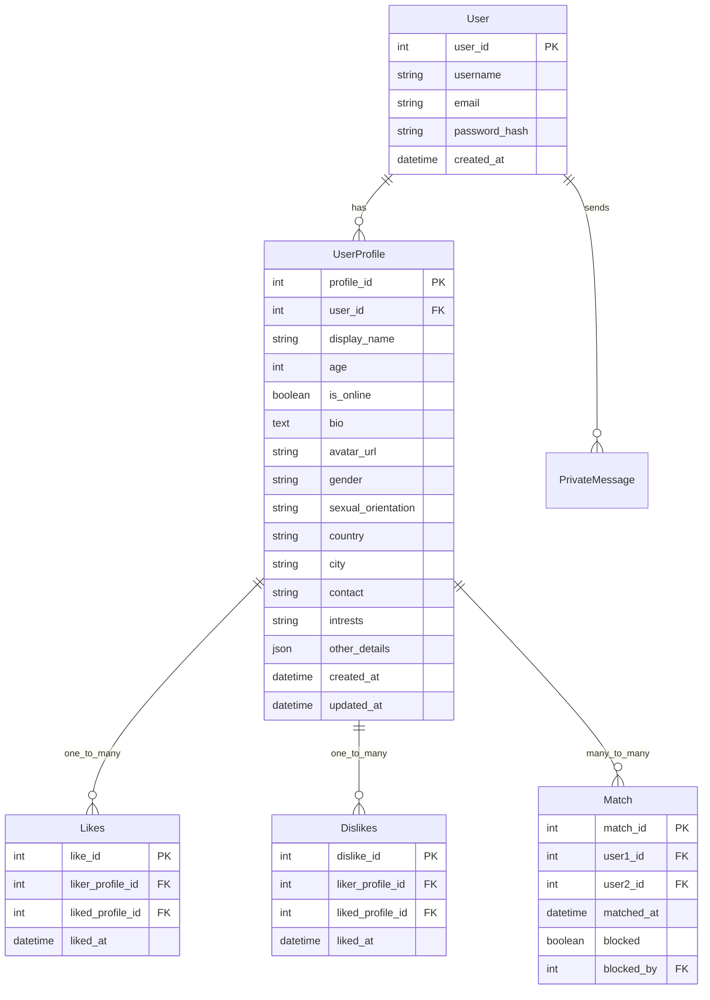

# ❤ Code to Love! ❤

To Do (After finishing the project, add here an image of how the main page looks like)

# SUBMISSION

## **Deployment**
* The platform is deployed using Heruko, making it accessible globally without additional hosting costs.
* Continuous updates and improvements are made to enhance the user experience and security.

[Click this link to view the Website.]() .... To Do...


## **Criteria**

Our team addressed these applicable criteria:

- ✨ Project is Full-Stack
- ✨ Project must be based on reality, inspired by Dating Webpages.
- ✨ Basic Readme.md in place

# **🧑‍💻 About the Submission**


## **Intro**


## **Goal**


## User Stories

* As a user, I want to be able to .... so i can ......


## UX 
### Colors
-  Incorporate a palette of four colors.
To Do .... 

### Typography
- font...... To Do

### Imagery
- Team Logo
To Do ....

## Wireframes

To Do ....

## System Design

### Entity Relationship Diagram for Chat Application

This ERD represents a simplified model for a chat application with public and private chat rooms, user profiles, and file attachments.




## **💻 Tech Stack**
This platform is built using modern web technologies to ensure accessibility, responsiveness, and ease of use:
* HTML: For structuring the content of the website.
* CSS: For styling and visual enhancements.
* React: To enable dynamic interactivity and functionality.
* Django REST Framework: Used for ... To Do.
* Bootstrap: A front-end framework to ensure a mobile-friendly and responsive layout.


## Features


## Testing 


## Validation

1. W3C Markup Validator ( [Results]() )
    - To Do ...
    
1. W3C CSS Validator ( [Results]() )
    - To Do ...

1. Jshint javascript validator ([Results]())
    - To Do ..


## Performance

The website performance was examined using the [Google Lighthouse](https://developers.google.com/web/tools/lighthouse/)

Click on [Results]() to view the performance.... To Do

## Credits

1. Resources used : 
    -  https://github.com/aop4/heroku-django-REST-template

# Team members

- **Many thanks to the team members for the hard work and cooperation.**

  - **Warren Smith** - [GitHub](https://github.com/Wxrren), [LinkedIn](https://www.linkedin.com/in/warren-smith-b43b20183/
  )
   Design/ Development / Documentation

  - **Nazek Altayeb** - [GitHub](https://github.com/Nazek-Altayeb), [LinkedIn](https://www.linkedin.com/in/nazek-a-altayeb/)
   Design/ Development / Documentation

  - **Dimitri** - [GitHub](https://github.com/dimitri-edel),
   Design/ Development / Documentation

  - **Laurie** - [GitHub](http://github.com/lmcrean),
   Design/ Development / Documentation

  - **Allan** - [GitHub](https://github.com/Allano256),
   Design/ Development / Documentation


# Contribution


# Contact & Support
=======
    UserProfile ||--o{ Likes : one_to_many
    User ||--o{ Match : one_to_many

### Algorithm for finding a match
When user likes someone, check if the the other user likes them back

#### Like User View (Django REST Framework)

This code implements a Django REST Framework view that handles user "likes" and creates matches when reciprocal likes occur.

```python
from rest_framework import status
from rest_framework.response import Response
from rest_framework.views import APIView
from .models import UserProfile, Likes, Match
from .serializers import LikesSerializer, MatchSerializer  # Create these serializers

class LikeUserView(APIView):
    def post(self, request, liked_profile_id):  # liked_profile_id is the ID of the profile being liked
        liker_profile = request.user.userprofile  # Assuming authentication is handled and user has a profile
        try:
            liked_profile = UserProfile.objects.get(pk=liked_profile_id)
        except UserProfile.DoesNotExist:
            return Response({"error": "Liked profile not found."}, status=status.HTTP_404_NOT_FOUND)

        # Check if the like already exists (prevent duplicate likes)
        if Likes.objects.filter(liker_profile=liker_profile, liked_profile=liked_profile).exists():
            return Response({"message": "You already liked this user."}, status=status.HTTP_400_BAD_REQUEST)

        # Create the Like record
        like_data = {"liker_profile": liker_profile.pk, "liked_profile": liked_profile.pk}
        like_serializer = LikesSerializer(data=like_data)
        if like_serializer.is_valid():
            like = like_serializer.save()

            # Check for a reciprocal like (Match)
            if Likes.objects.filter(liker_profile=liked_profile, liked_profile=liker_profile).exists():
                # Create the Match
                try:
                    # Check if the match already exists to prevent duplicates
                    Match.objects.get(user1=liker_profile, user2=liked_profile) # Or the reverse order
                    return Response({"message": "Already matched with this user"}, status=status.HTTP_400_BAD_REQUEST)

                except Match.DoesNotExist:
                    match_data = {"user1": liker_profile.pk, "user2": liked_profile.pk} # Or the reverse order
                    match_serializer = MatchSerializer(data=match_data)
                    if match_serializer.is_valid():
                        match = match_serializer.save()
                        return Response({"message": "You have a match!", "match_id": match.pk}, status=status.HTTP_201_CREATED)
                    else:
                        return Response(match_serializer.errors, status=status.HTTP_400_BAD_REQUEST)
            return Response({"message": "Like recorded."}, status=status.HTTP_201_CREATED)
        else:
            return Response(like_serializer.errors, status=status.HTTP_400_BAD_REQUEST)
```

#### Serializer (example)
```python
from rest_framework import serializers
from .models import Likes, Match

class LikesSerializer(serializers.ModelSerializer):
    class Meta:
        model = Likes
        fields = ('liker_profile', 'liked_profile')  # Or just 'id' if you want DRF to handle it

class MatchSerializer(serializers.ModelSerializer):
    class Meta:
        model = Match
        fields = ('user1', 'user2') # Or just 'id' if you want DRF to handle it

```

#### Model (example)
```python
from django.db import models
from django.contrib.auth.models import User # If you are using default django user model

class UserProfile(models.Model):
    user = models.OneToOneField(User, on_delete=models.CASCADE) # One to one with django user model
    # ... other fields ...

class Likes(models.Model):
    liker_profile = models.ForeignKey(UserProfile, on_delete=models.CASCADE, related_name='given_likes')
    liked_profile = models.ForeignKey(UserProfile, on_delete=models.CASCADE, related_name='received_likes')
    liked_at = models.DateTimeField(auto_now_add=True)

    class Meta:
        unique_together = ('liker_profile', 'liked_profile') # To prevent duplicate likes


class Match(models.Model):
    user1 = models.ForeignKey(UserProfile, on_delete=models.CASCADE, related_name='matches1')
    user2 = models.ForeignKey(UserProfile, on_delete=models.CASCADE, related_name='matches2')
    matched_at = models.DateTimeField(auto_now_add=True)

    class Meta:
        unique_together = ('user1', 'user2') # To prevent duplicate matches
```


